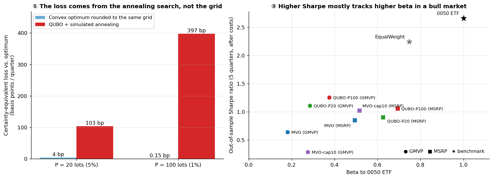

# QUBO / Annealing Portfolio Optimization on Taiwan 50 Constituents

*The bottleneck is the budget penalty, not discretisation; the QUBO portfolios' out-of-sample edge is beta, not alpha.*

[中文版 README](README.md) · [Research presentation (PDF, zh-TW)](docs/slides/Quantum_Annealing_Portfolio_Optimization.pdf) · [Literature review (zh-TW)](docs/literature-review.md)

## At a glance

| | |
|---|---|
| **Question** | If a portfolio problem is written in a quantum annealer's input format (a QUBO) and solved by annealing, how good are the solutions? And is a better-optimised portfolio a better investment? |
| **Why it matters** | Quantum-portfolio studies judge solvers almost only by distance to the optimum, and their comparisons cannot separate solver loss from discretisation loss. The finance literature has long shown that optimisers amplify forecast errors. |
| **How** | A 5-quarter walk-forward backtest on the constituents of the Taiwan 50 ETF (0050), 2025/03–2026/03. Every method sees the same expected returns and covariances. The key control rounds the classical optimum to the same lot grid, which isolates the cost of discretisation. |
| **Result** | ① QUBO + annealing loses 103–397 bp per quarter; rounding loses only 0.15–4 bp, so the bottleneck is the energy landscape created by the budget penalty. ② QUBO portfolios had higher out-of-sample Sharpe ratios, mostly through higher beta, and a simple weight cap reproduces the effect. ③ Every optimised portfolio trailed equal weight and the 0050 ETF. |



*Left: certainty-equivalent loss against the optimum on the identical objective (mean over 7 values of γ). Right: out-of-sample Sharpe ratio against beta to 0050 (median across five covariance estimators).*

> **Disclosure:** no quantum hardware was used. All QUBO results come from D-Wave Ocean's classical simulated annealer (`neal`).
> The code has a QPU / Leap-hybrid switch (`DWAVE_API_TOKEN`), but the dense 50-asset × 7-bit QUBO exceeds what an Advantage QPU can embed directly.

## Research questions

1. **When a portfolio problem is written as a QUBO and solved by annealing, how good are the solutions, and where is the bottleneck?**
   Getting to a QUBO takes three steps: discretisation, binary encoding, and a budget penalty. Each step can cost solution quality. Most studies compare the discrete QUBO solution directly with the continuous convex optimum, so they cannot tell whether a gap comes from the solver or from discretisation.
2. **With noisy expected returns, does a better-optimised portfolio mean a better investment? Does discretisation act like regularisation?**
   Quantum-portfolio studies judge solvers almost only by regret, which assumes that the best objective value is the best investment. The estimation-error literature disagrees: optimisers amplify input errors (Michaud, 1989), and weight constraints are equivalent to covariance shrinkage (Jagannathan & Ma, 2003). Discretisation also constrains the solution space, but this link had not been tested.

## Method

- **Universe and timing:** the 49–51 constituents of 0050 in each quarter. Weights are set at the close of each index-review announcement day and held until the next one; long-only and fully invested.
- **Inputs:** expected returns from a pooled single-layer LSTM retrained each quarter with a 63-day purge; covariances from 252 trading days with five estimators (sample, EWMA, three Ledoit–Wolf targets).
- **Solvers on the same objective:** convex MVO, MVO with a 10% weight cap, MVO rounded to the 1/P grid, continuous simulated annealing (`scipy` dual annealing), and QUBO + simulated annealing at P = 20 and P = 100 lots.
- **QUBO:** bounded binary encoding of lot counts and a budget penalty λ(Σx − P)². λ is scaled by L, the largest objective gain one violated lot can buy, and set to 0.1·L by an ex-ante sensitivity experiment.
- **Costs and benchmarks:** 0.1425% commission and 0.3% transaction tax; equal weight and the 0050 ETF.

## Key findings

1. **Annealing on the penalised QUBO lands far from the optimum, and discretisation is not the cause.** The objective function is the same for every method.
   - **QUBO + simulated annealing:**
     - It loses 1.0 pp (P=20) to 4.0 pp (P=100) of certainty-equivalent return per quarter.
     - Its GMVP volatility is 21–31% above the optimum.
   - **Rounding the convex optimum to the same 1/P grid** costs almost nothing (0.15 bp at P=100, 4 bp at P=20).
   - **The bottleneck is the budget penalty.** A smaller penalty gives better solutions, and more sweeps barely help.
   - **Higher precision is worse:** P=100 loses about 4× as much as P=20.
2. **Worse-optimised QUBO portfolios had higher out-of-sample Sharpe ratios, but that is beta, not alpha.**
   - They are more diversified and have a higher beta to 0050: 0.37 vs 0.18 for GMVP, 0.69 vs 0.49 for MSRP.
   - Over these quarters 0050 rose 128%, so higher beta meant higher returns.
   - The GMVP edge holds under all five covariance estimators (Sharpe 1.02–1.43 for QUBO-P100 vs 0.50–0.87 for MVO), but the excess return came mainly from the strongest quarters.
   - On GMVP's own goal, low volatility, plain MVO had lower realised volatility (11.4–12.1% vs 13.7–14.8%) and drawdown under every estimator.
   - QUBO weights were not closer to the ex-post optimal weights than MVO's.
3. **A simple explicit regulariser reproduces most of the MSRP effect.** MVO with a 10% weight cap reached Sharpe 1.02 vs 1.06 for QUBO-P100, with lower risk.
4. **Every optimised portfolio trailed the passive benchmarks.**
   - Equal weight had a Sharpe ratio of 2.25 and the 0050 ETF 2.67; the best optimiser reached about 1.26.
   - On each decision date, the LSTM's expected returns had an average rank correlation of only 0.02 with realised holding-period returns.

| Portfolio | Method | Ann. return | Ann. vol | Sharpe | Max DD | Beta |
|---|---|---:|---:|---:|---:|---:|
| GMVP | MVO | 7.0% | 11.7% | 0.64 | −7.5% | 0.18 |
| GMVP | QUBO P=100 | 18.3% | 14.6% | 1.26 | −12.0% | 0.37 |
| MSRP | MVO | 19.6% | 24.7% | 0.85 | −17.8% | 0.49 |
| MSRP | MVO + 10% cap | 21.3% | 20.8% | 1.02 | −16.9% | 0.52 |
| MSRP | QUBO P=100 | 30.9% | 29.6% | 1.06 | −21.3% | 0.69 |
| — | Equal weight | 63.6% | 23.1% | 2.25 | −20.5% | 0.75 |
| — | 0050 ETF | 98.2% | 27.1% | 2.67 | −21.1% | 1.00 |

Each figure is the median across five covariance estimators. Full tables are in [`results/summary/`](results/summary/).

## Conclusions

**RQ1: How good are QUBO + annealing solutions, and where is the bottleneck?**
They are clearly worse than the classical solution: 1–4 pp of certainty-equivalent return lost per quarter, GMVP volatility 21–31% above the optimum, and solve times tens to thousands of times longer than convex optimisation. Discretisation is not the cause, because rounding to the same grid costs almost nothing. Annealing time is not the cause either, because 16× more sweeps did not help. The bottleneck is **the energy landscape created by the budget penalty**. A penalty large enough to guarantee feasibility separates feasible solutions with high barriers that single-bit-flip annealing cannot cross, and finer precision makes the landscape rougher.

**RQ2: With noisy expected returns, is a better-optimised portfolio a better investment?**
No. The worse-optimised QUBO portfolios had higher out-of-sample Sharpe ratios, so solution quality and investment performance do decouple. The decoupling does not come from discretisation itself, since rounded portfolios performed like MVO. It comes from annealing stopping at more diversified, higher-beta portfolios, which paid off in a strong bull market:
- The GMVP edge holds under all five covariance estimators, but the excess return came mainly from the strongest quarters, and QUBO-GMVP fell more in the 2025/03 tariff-shock quarter.
- On GMVP's own goal, low volatility, MVO was better under every estimator.
- QUBO solutions were not closer to the ex-post optimal weights.
- A 10% weight cap reproduced the MSRP effect with lower risk.

The "discretisation as implicit regularisation" hypothesis therefore receives only weak support. The useful ingredient is diversification, which explicit classical constraints deliver more cheaply and more controllably.

**Overall,** QUBO + annealing offers no advantage on a 50-asset long-only mean-variance problem, which is convex and solved to global optimality in milliseconds. When evaluating quantum or quantum-inspired solvers, solution quality and investment performance should be reported together. Beta, diversification and market regime should be ruled out before a difference is credited to the solver.

## Contributions

- **Separating discretisation loss from solver loss.** A "round the convex optimum to the same grid" baseline shows that discretisation costs 0.15–4 bp, while QUBO + annealing costs 103–397 bp. The bottleneck is the penalty landscape, not the grid.
- **A reproducible penalty rule.** λ is scaled by L, the largest objective gain one violated lot can buy. It is chosen by an ex-ante sensitivity experiment, and feasibility and repair rates are reported.
- **The QPU finding reproduced on classical annealing.** Lozano (2026a) found the penalty encoding to be the bottleneck on a QPU; this study finds the same with classical annealing. The problem lies in the formulation, so it can be studied cheaply without quantum hardware.
- **Linking two literatures.** The study brings the estimation-error and regularisation literature into quantum portfolio research and tests the "discretisation as implicit regularisation" hypothesis.
- **Decomposing the decoupling.** The higher Sharpe of QUBO portfolios comes from diversification and beta, and a 10% weight cap reproduces it with lower risk. The hypothesis therefore receives only weak support.
- **A fuller evaluation.** Solution quality, investment performance and solve time are reported together, with walk-forward testing, transaction costs and five covariance estimators. Before crediting a new solver, beta, diversification and market regime should be ruled out.

## Future directions

Adapted from section 8 of the [literature review](docs/literature-review.md):

1. **Test implicit regularisation against explicit regularisers.** Add L2 penalties, shrinkage, robust optimisation and resampled frontiers. Inject noise of increasing strength into the true returns and find the noise level at which discrete solutions start to win. No quantum hardware is needed.
2. **Fix the formulation, not just the parameters.** Compare budget-preserving moves (lot-swap annealing moves, XY mixers), one-hot or unary encodings, and penalty-free constrained models (CQM).
3. **Add quantum dynamics.** First compare simulated quantum annealing (e.g. OpenJij's `SQASampler`) with `neal` on the same QUBOs, to test whether tunnelling eases the penalty barriers. Then run reduced problems on Advantage / Advantage2 QPUs and compare `neal`, tabu search and hybrid BQM / DQM / CQM under equal time budgets.
4. **Move to problems that are hard for classical solvers.** Examples are cardinality constraints, whole-lot trading (Taiwan stocks trade in lots of 1,000 shares), tiered fees and multi-period rebalancing. First confirm that Gurobi actually slows down on such problems.
5. **Costs, longer samples and better forecasts.** Put transaction costs and turnover limits into the objective. Extend the out-of-sample period to cover bear and sideways markets, so that beta and alpha can be separated statistically. Check whether the conclusions hold when expected returns carry a stronger signal.

## Reproduce

```bash
pip install -r requirements.txt
pytest
python scripts/run_experiments.py      # ~1.5 h on 16 cores
python scripts/penalty_sensitivity.py
python scripts/analyze.py
```

All intermediate results are committed under `results/`, so the notebooks in `notebooks/` can be read without re-running anything.

## Data

- Adjusted daily prices come from FinMind.
- 0050 holdings come from TEJ.
- The 0050 ETF series comes from Yahoo Finance.

The data are shared with the lab's permission for reproducibility only; see [`data/README.md`](data/README.md). The code is released under the MIT License.
