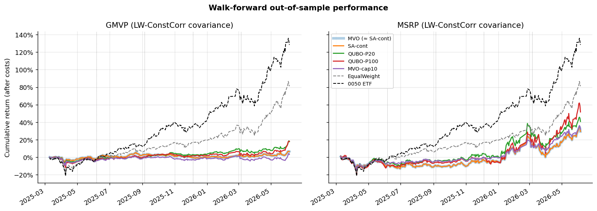

# QUBO / Annealing Portfolio Optimization on Taiwan 50 Constituents

[中文版 README](README.md) · [Literature review (zh-TW)](docs/literature-review.md) · [Final presentation (PDF, zh-TW)](docs/slides/Quantum_Annealing_Portfolio_Optimization.pdf)

This is a research project from the AI Quantum Computing Lab, Department of MIS, National Chengchi University (Spring 2026).
It formulates long-only Markowitz portfolios (minimum variance, GMVP, and maximum Sharpe, MSRP) as QUBOs, the input format of D-Wave quantum annealers, and solves them with annealing.
The QUBO solutions are compared with classical convex optimisation, continuous simulated annealing, and a "round the convex optimum to the same lot grid" baseline.
The comparison is a 5-quarter walk-forward backtest on the constituents of the Taiwan 50 ETF (0050), from 2025/03 to 2026/03, with LSTM-forecast expected returns, five covariance estimators, and transaction costs.

> **Disclosure:** no quantum hardware was used. All QUBO results come from D-Wave Ocean's classical simulated annealer (`neal`).
> The code has a QPU / Leap-hybrid switch (`DWAVE_API_TOKEN`), but the dense 50-asset × 7-bit QUBO exceeds what an Advantage QPU can embed directly.



## Key findings

1. **Annealing on the penalised QUBO lands far from the optimum, and discretisation is not the cause.** The objective function is the same for every method.
   - **QUBO + simulated annealing:**
     - It loses 1.0 pp (P=20) to 4.0 pp (P=100) of certainty-equivalent return per quarter.
     - Its GMVP volatility is 21–31% above the optimum.
   - **Rounding the convex optimum to the same 1/P grid** costs almost nothing (< 0.1 bp at P=100).
   - **The bottleneck is the budget penalty.** A smaller penalty gives better solutions, and more sweeps barely help.
   - **Higher precision is worse:** P=100 loses about 4× as much as P=20.
2. **Worse-optimised QUBO portfolios had higher out-of-sample Sharpe ratios, but that is beta, not alpha.**
   - They are more diversified and have a higher beta to 0050: 0.37 vs 0.18 for GMVP, 0.69 vs 0.49 for MSRP.
   - Over these quarters 0050 rose 128%, so higher beta meant higher returns.
   - On GMVP's own goal, low volatility, plain MVO had lower realised volatility and drawdown.
3. **A simple explicit regulariser reproduces most of the MSRP effect.** MVO with a 10% weight cap reached Sharpe 1.02 vs 1.06 for QUBO-P100, with lower risk.
4. **Every optimised portfolio trailed the passive benchmarks.**
   - Equal weight had a Sharpe ratio of 2.25 and the 0050 ETF 2.67; the best optimiser reached about 1.26.
   - On each decision date, the LSTM's expected returns had an average rank correlation of only 0.02 with realised holding-period returns.

| Portfolio | Method | Ann. return | Ann. vol | Sharpe | Max DD | Beta |
|---|---|---:|---:|---:|---:|---:|
| GMVP | MVO | 7.0% | 11.7% | 0.64 | −7.5% | 0.18 |
| GMVP | QUBO P=100 | 18.3% | 14.6% | 1.26 | −12.0% | 0.37 |
| MSRP | MVO | 19.6% | 24.7% | 0.85 | −17.8% | 0.49 |
| MSRP | MVO + 10% cap | 21.3% | 20.8% | 1.02 | −16.9% | 0.52 |
| MSRP | QUBO P=100 | 30.9% | 29.6% | 1.06 | −21.3% | 0.69 |
| — | Equal weight | 63.6% | 23.1% | 2.25 | −20.5% | 0.75 |
| — | 0050 ETF | 98.2% | 27.1% | 2.67 | −21.1% | 1.00 |

Each figure is the median across five covariance estimators. Full tables are in [`results/summary/`](results/summary/).

## Reproduce

```bash
pip install -r requirements.txt
pytest
python scripts/run_experiments.py      # ~1.5 h on 16 cores
python scripts/penalty_sensitivity.py
python scripts/analyze.py
```

All intermediate results are committed under `results/`, so the notebooks in `notebooks/` can be read without re-running anything.

## Data

- Adjusted daily prices come from FinMind.
- 0050 holdings come from TEJ.
- The 0050 ETF series comes from Yahoo Finance.

The data are shared with the lab's permission for reproducibility only; see [`data/README.md`](data/README.md). The code is released under the MIT License.
