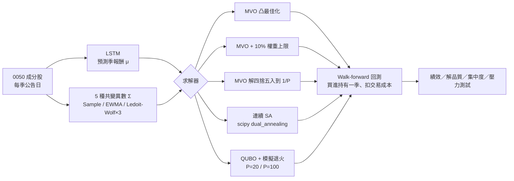

# 以 QUBO／退火求解投資組合最佳化：台灣 50 成分股的 Walk-Forward 實證

**Quantum-Annealing-Style (QUBO) Portfolio Optimization on Taiwan 50 Constituents — a walk-forward study**

*瓶頸在懲罰項，不在離散化；QUBO 組合的樣本外優勢來自 beta，不是 alpha。*

[English README](README.en.md) · [研究簡報（PDF）](docs/slides/Quantum_Annealing_Portfolio_Optimization.pdf) · [文獻回顧](docs/literature-review.md) · [量子退火教學簡報（PDF）](docs/slides/量子退火_教學簡報.pdf)

## 一分鐘看懂

| | |
|---|---|
| **問題** | 把投資組合問題寫成量子退火機的輸入格式（QUBO）再用退火求解，解得好嗎？解得比較好，就等於投資比較好嗎？ |
| **為什麼重要** | 量子投組文獻幾乎只用「離最佳解多近」來評估，而且比較方式分不出損失是來自求解器還是離散化。金融文獻則早就指出，最佳化會放大預測誤差。 |
| **怎麼做** | 以台灣 50（0050）成分股做 5 季樣本外回測（2025/03～2026/03）。所有方法面對同一組預期報酬與風險；關鍵對照組是「把古典最佳解四捨五入到同一格點」，用來單獨量出離散化的損失。 |
| **結果** | ① QUBO＋退火每季損失 103～397 bp，四捨五入只損失 0.15～4 bp，瓶頸在預算懲罰項造成的能量地形。② QUBO 組合樣本外 Sharpe 較高，但主要來自較高的 beta，簡單的權重上限就能複製。③ 所有最佳化組合都輸給等權重與 0050。 |


*左：同一目標函數下，與最佳解的確定等值報酬損失（7 個 γ 平均）。右：樣本外 Sharpe 對 0050 的 beta（跨 5 種共變異數估計式取中位數）。*

> **誠實聲明：本研究沒有使用量子硬體。** 所有 QUBO 結果都由 D-Wave Ocean 的古典模擬退火 `neal` 產生。
> 程式碼已預留 QPU／Leap hybrid 介面（[`samplers.py`](src/qaportfolio/samplers.py)），但 50 檔 × 7 bits 的稠密 QUBO
> 超過 Advantage QPU 可直接嵌入的規模。因此本研究的結論是關於「QUBO 形式與退火搜尋」，而非量子效應。

---

## 研究問題與動機

**RQ1：把投資組合問題寫成 QUBO 並以退火求解，解的品質如何？瓶頸在哪裡？**

* 退火機只接受 QUBO，必須先經過「離散化 → 二進位編碼 → 預算限制改寫成 penalty」三步轉換，每一步都可能讓解變差。
* 多數研究拿離散的 QUBO 解直接對照連續的凸最佳解（[文獻回顧](docs/literature-review.md) 6.3 節），分不出差距來自求解器還是離散化。

**RQ2：在含雜訊的預期報酬下，「解得比較好」是否等於「投資比較好」？離散化是否會帶來類似正則化的效果？**

* 量子投組研究幾乎只以 regret（與最佳解的差距）評估，等於預設目標函數最佳就是投資最佳。
* 金融文獻早有反證：最佳化會放大估計誤差（Michaud, 1989），權重限制等同對 Σ 做收縮（Jagannathan & Ma, 2003）。離散化同樣限制了解空間，可能「意外地」產生正則化效果，但這個假說在量子投組文獻中尚未被檢驗。

## 方法



| 步驟 | 設定 |
|---|---|
| 投資範圍 | 各季 0050 成分股（49～51 檔），2025/03～2026/03 共 5 季 |
| 決策與持有 | 每年 3/6/9/12 月第一個星期五（0050 成分股調整公告日）收盤決定權重，持有至下一次公告日；long-only、權重和為 1 |
| 投資組合 | GMVP（全域最小變異）與 MSRP（最大夏普比率） |
| 預期報酬 μ | 跨股票共用的單層 LSTM（63 日 × 19 個價量特徵 → 未來 63 日報酬），每季以當時可得資料重新訓練，訓練／驗證之間設 63 日 purge |
| 共變異數 Σ | 決策日前 252 個交易日；Sample、EWMA、Ledoit–Wolf（identity／constant-correlation／single-factor）。主圖使用事先指定的 LW-ConstCorr |
| 交易成本 | 手續費 0.1425%（買賣）＋證交稅 0.3%（賣） |
| 基準 | 等權重（每季再平衡）、0050 ETF 買進持有 |

### QUBO 建模

把資金切成 $P$ 份，$x_i\in\{0,\dots,P\}$ 為第 $i$ 檔分到的份數、$w_i=x_i/P$，並以有界二進位展開 $x_i=\sum_k c_k b_{ik}$（$P=20$：$c=(1,2,4,8,5)$；$P=100$：$c=(1,2,4,8,16,32,37)$）：

$$
\min_{b\in\{0,1\}^{nK}}\;\frac{\gamma}{2P^2}x^\top\Sigma x-\frac{1}{P}\mu^\top x+\lambda\Big(\sum_i x_i-P\Big)^2 .
$$

* **GMVP** 只保留 $x^\top\Sigma x/P^2$。
* **MSRP**：Sharpe 不是二次式，因此在 $\gamma\in\{0.5,1,2,5,10,20,50\}$ 上各解一次，取事前 Sharpe 最高者。
* **λ** 以「每違反一個 lot 可換得的最大目標改善量」$L$ 為尺度。$\lambda>L$ 理論上保證最低能量解可行，但實驗發現此時 penalty 主導地形、退火幾乎無法在可行解間移動。因此依 [penalty 敏感度實驗](scripts/penalty_sensitivity.py)，選擇可行率仍 ≥ 50% 的最小係數 $\lambda=0.1L$。這個實驗只使用第一季的事前輸入，不含任何未來資料；不可行的解以最大餘數法修復，並記錄比例。
* 求解器：`neal.SimulatedAnnealingSampler`（P=20：100 reads × 2,000 sweeps；P=100：300 reads × 8,000 sweeps）。

## 主要結果

### 1. 解的品質：瓶頸在懲罰項，不在離散化

在完全相同的均值—變異數目標下，QUBO＋退火離最佳解很遠，但把凸最佳解四捨五入到同一格點幾乎沒有損失。

| | QUBO P=20 | QUBO P=100 | 凸最佳解四捨五入到 P=20 | 凸最佳解四捨五入到 P=100 |
|---|---:|---:|---:|---:|
| 均值—變異數：確定等值報酬損失（每季，7 個 γ 平均） | 103 bp | 397 bp | 4 bp | 0.15 bp |
| GMVP：事前波動度 ÷ 最佳波動度 | 1.21 | 1.31 | 1.01 | 1.00 |
| 預算可行率（所有 reads；均值—變異數／GMVP） | 50%／97% | 57%／90% | — | — |
| 求解時間（每個問題，中位數） | 6 秒 | 155 秒 | ≈ 0 | ≈ 0 |

*5 季 × 5 種共變異數估計式的平均。連續 SA（`dual_annealing`，約 2.5 秒）與 MVO 精確解幾乎完全一致。*

從表中與敏感度實驗可以讀出四件事：

* **離散化本身幾乎不花成本。** 四捨五入到 5% 一格（P=20）每季只損失約 4 bp，到 1% 一格（P=100）只有 0.15 bp；GMVP 的波動度也只比最佳解高 0.1%～1%。QUBO＋退火的損失是它的約 30～2,700 倍，因此差距幾乎全部來自退火的搜尋。
* **精度越高，解反而越差。** P=100 每季損失 397 bp，約為 P=20（103 bp）的 4 倍；GMVP 的超額波動也從 21% 升到 31%。格點變細本應讓解更接近最佳解，但位元數增加（250 → 350 個變數）、最高位係數變大（37），單一位元翻轉造成的能量跳動更劇烈，搜尋更容易卡在次佳解。
* **λ 越小解越好，但可行率會崩潰。** 在第一季的事前輸入上，λ 從 2L 降到 0.1L 時，GMVP 的超額波動由 62%～70% 降到 20%～41%，均值—變異數問題（γ=5）的損失由 608～740 bp 降到 69～415 bp。λ 再降到 0.05L，均值—變異數問題的可行率掉到 2%（P=20），解幾乎都要靠修復。λ > L 雖然在理論上保證最低能量解可行，卻讓 penalty 主導能量地形，可行解之間被高能障隔開。
* **增加退火時間幾乎無效。** sweeps 從 2,000 增加到 32,000（16 倍），損失沒有一致的改善，有時甚至變差。這表示問題不在冷卻太快，而在能量地形本身。

可行率在小 γ（偏重報酬）時特別低：P=20 在 γ ≤ 2 時幾乎所有 reads 都不可行。被選為 MSRP 的解集中在 γ=5～10，其中 P=100 有 12% 經過最大餘數法修復。


*penalty 係數 λ/L 越小，解越接近最佳解；sweeps 從 2,000 增加到 32,000 幾乎沒有改善。最左側（0.05）的 MV 問題可行率接近 0，數值主要來自修復步驟。*

<details>
<summary>各 γ 的解品質（圖）</summary>


</details>

### 2. 樣本外績效：QUBO 的 Sharpe 較高，但那是 beta

| 組合 | 方法 | 年化報酬 | 年化波動 | Sharpe | 最大回撤 | Beta (0050) |
|---|---|---:|---:|---:|---:|---:|
| GMVP | MVO | 7.0% | 11.7% | 0.64 | −7.5% | 0.18 |
| GMVP | **QUBO P=100** | 18.3% | 14.6% | 1.26 | −12.0% | 0.37 |
| MSRP | MVO | 19.6% | 24.7% | 0.85 | −17.8% | 0.49 |
| MSRP | MVO + 10% 上限 | 21.3% | 20.8% | 1.02 | −16.9% | 0.52 |
| MSRP | **QUBO P=100** | 30.9% | 29.6% | 1.06 | −21.3% | 0.69 |
| — | 等權重 | 63.6% | 23.1% | **2.25** | −20.5% | 0.75 |
| — | 0050 ETF | 98.2% | 27.1% | **2.67** | −21.1% | 1.00 |

*5 季、扣交易成本，跨 5 種共變異數估計式取中位數。*

**QUBO 組合樣本外 Sharpe 較高，而且不依賴特定的共變異數估計式。** GMVP 上，QUBO-P100 在全部 5 種估計式下的 Sharpe（1.02～1.43）都高於 MVO（0.50～0.87）；以「同一估計式、同一季」比較季報酬名次，QUBO-P20／P100 的平均名次（2.6／2.7）也是 7 種方法中最好的。

**但這個優勢可以用 beta 和分散度解釋，而不是求解器找到了更好的組合：**

* **QUBO 組合較分散、市場曝險較高。** GMVP 的有效持股數 QUBO-P100 約 13.6 檔、MVO 約 3.2 檔；最大單一權重 16% vs 53%。對 0050 的 beta 也較高（GMVP 0.37 vs 0.18；MSRP 0.69 vs 0.49）。
* **超額報酬集中在大漲的季度。** 以主估計式 LW-ConstCorr 為例，QUBO-P100 的 GMVP 領先 MVO 主要來自 2025/09（+1.3% vs −3.1%）與 2026/03（+13.4% vs +4.7%）；在 2025/03 的關稅衝擊季，它反而跌得較多（−2.9% vs −1.8%）。這正是高 beta 組合的特徵。
* **以 GMVP 本身的目標衡量，MVO 仍較好。** GMVP 要的是低波動。MVO 在全部 5 種估計式下的實現波動（11.4%～12.1%）都低於 QUBO-P100（13.7%～14.8%），最大回撤也較小（−7.5% vs −12.0%）。
* **QUBO 解並沒有更接近事後最佳解。** 以實現的報酬與共變異數求出事後（oracle）最佳權重，GMVP 中 QUBO 解與它的 L1 距離（1.30～1.32）反而比 MVO（1.14）遠；MSRP 中最接近 oracle 的是 MVO + 10% 上限（1.67），其次才是 QUBO-P100（1.75）。
* **簡單的權重上限就能複製 MSRP 的效果。** MVO 加上 10% 單一權重上限，Sharpe 1.02，與 QUBO-P100 的 1.06 相當，而且波動（20.8% vs 29.6%）與回撤（−16.9% vs −21.3%）都更低；在 5 種估計式中有 3 種的 Sharpe 不低於 QUBO-P100。GMVP 加上限則沒有改善（0.28），這也說明 QUBO-GMVP 的優勢來自保留下來的市場曝險，而不是分散本身。

| 組合 | 方法 | 有效持股數 | 持股檔數 | 最大權重 |
|---|---|---:|---:|---:|
| GMVP | MVO | 3.2 | 12.7 | 53% |
| GMVP | MVO + 10% 上限 | 11.9 | 19.1 | 10% |
| GMVP | QUBO P=20 | 6.9 | 11.0 | 29% |
| GMVP | QUBO P=100 | 13.6 | 26.9 | 16% |
| MSRP | MVO | 4.7 | 7.4 | 32% |
| MSRP | MVO + 10% 上限 | 11.3 | 14.4 | 10% |
| MSRP | QUBO P=20 | 5.5 | 8.0 | 32% |
| MSRP | QUBO P=100 | 8.0 | 17.1 | 26% |

*有效持股數 = 1 / Σwᵢ²，5 季 × 5 種估計式的平均。*

<details>
<summary>完整績效表（7 種方法 × 2 種組合）、淨值走勢、每季報酬與集中度</summary>

| 組合 | 方法 | 年化報酬 | 年化波動 | Sharpe | 最大回撤 | Beta (0050) | 平均周轉率 |
|---|---|---:|---:|---:|---:|---:|---:|
| GMVP | MVO | 7.0% | 11.7% | 0.64 | −7.5% | 0.18 | 34% |
| GMVP | 連續 SA | 7.0% | 11.7% | 0.64 | −7.5% | 0.18 | 34% |
| GMVP | MVO 四捨五入 P=100 | 6.8% | 11.8% | 0.62 | −7.5% | 0.18 | 35% |
| GMVP | MVO + 10% 上限 | 2.9% | 13.2% | 0.28 | −9.7% | 0.28 | 35% |
| GMVP | **QUBO P=20** | 14.9% | 13.3% | 1.11 | −9.3% | 0.28 | 64% |
| GMVP | **QUBO P=100** | 18.3% | 14.6% | 1.26 | −12.0% | 0.37 | 55% |
| MSRP | MVO | 19.6% | 24.7% | 0.85 | −17.8% | 0.49 | 82% |
| MSRP | 連續 SA | 19.6% | 24.7% | 0.85 | −17.8% | 0.49 | 82% |
| MSRP | MVO 四捨五入 P=100 | 19.6% | 24.7% | 0.85 | −17.7% | 0.49 | 83% |
| MSRP | MVO + 10% 上限 | 21.3% | 20.8% | 1.02 | −16.9% | 0.52 | 67% |
| MSRP | **QUBO P=20** | 26.9% | 30.2% | 0.90 | −21.8% | 0.63 | 82% |
| MSRP | **QUBO P=100** | 30.9% | 29.6% | 1.06 | −21.3% | 0.69 | 75% |
| — | 等權重 | 63.6% | 23.1% | **2.25** | −20.5% | 0.75 | 29% |
| — | 0050 ETF | 98.2% | 27.1% | **2.67** | −21.1% | 1.00 | — |

各策略、各估計式的完整數字見 [`results/summary/performance.csv`](results/summary/performance.csv)。


</details>

### 3. 被動基準勝出，預期報酬近乎雜訊

* **所有最佳化組合都明顯輸給被動基準。** 等權重 Sharpe 2.25、0050 ETF 2.67，最好的最佳化組合（QUBO-P100 GMVP）約 1.26。0050 五季上漲 128%，等權重上漲 81%（扣成本）。
* **LSTM 的預測幾乎沒有可用的訊號。** 決策日前 63 日的樣本外 Rank IC 平均 0.09（各季 0.01～0.17），方向準確率 61%，但 R² 每季皆為負。真正用來建倉的決策日預測，與實際持有期報酬的 Rank IC 平均只有 0.02，其中兩季為負（2025/03：−0.09；2026/03：−0.27）。
* **含意。** MSRP 最依賴 μ，而 μ 的排序訊號接近 0，最佳化器主要是在放大雜訊。這也是 GMVP（不使用 μ）與等權重（完全不最佳化）相對穩健的原因，呼應 DeMiguel et al.（2009）。

<details>
<summary>各季預測表現</summary>

| 季度 | 樣本外 Rank IC（決策日前 63 日） | 方向準確率 | 決策日 μ vs 實際持有期報酬的 Rank IC |
|---|---:|---:|---:|
| 2025/03 | 0.01 | 40% | −0.09 |
| 2025/06 | 0.13 | 64% | 0.18 |
| 2025/09 | 0.07 | 62% | 0.12 |
| 2025/12 | 0.17 | 66% | 0.16 |
| 2026/03 | 0.08 | 70% | −0.27 |
| **平均** | **0.09** | **61%** | **0.02** |

</details>

### 4. 事前壓力測試

以各組合在決策日前的歷史日報酬配適常態分布，模擬 100,000 條持有一季的路徑，估計 95% VaR／CVaR。5 季中沒有任何策略的實現報酬跌破事前 VaR。這段期間以上漲為主，壓力測試沒有區分出各方法的尾部風險差異。

## 結論

**RQ1：把投資組合寫成 QUBO 並以退火求解，解的品質如何？瓶頸在哪裡？**

解的品質明顯不如古典方法：每季損失 1～4 個百分點的確定等值報酬，GMVP 的事前波動高出 21%～31%，求解時間卻比凸最佳化慢數十到上千倍。瓶頸不在離散化，因為四捨五入到同一格點幾乎沒有損失；也不在退火時間，因為 sweeps 增加 16 倍沒有改善。瓶頸在**預算限制寫成 penalty 後所形成的能量地形**：penalty 夠大才能保證可行，但大 penalty 讓可行解之間隔著高能障，單一位元翻轉的退火難以移動；提高精度又讓地形更崎嶇。

**RQ2：在含雜訊的預期報酬下，「解得比較好」是否等於「投資比較好」？離散化是否像正則化？**

不等於。解得較差的 QUBO 組合，樣本外 Sharpe 反而較高，因此解品質與投資績效確實脫鉤。但脫鉤的來源不是離散化本身（四捨五入解與 MVO 的績效幾乎相同），而是退火停在較分散、beta 較高的次佳解，在強勁多頭中轉化為較高報酬。以 GMVP 自己的目標衡量，MVO 仍較好；MSRP 的效果則可用 10% 權重上限以更低風險複製。因此「離散化即隱式正則化」的假說只獲得**弱支持**：真正起作用的是次佳解的分散，而這用古典的顯式限制就能更便宜、更可控地做到。

**整體而言**，在 50 檔、long-only 的均值—變異數問題上，QUBO＋退火沒有任何優勢：這是凸問題，古典求解器在毫秒內就能求得全域最佳解。評估量子或量子啟發求解器時，應同時報告解品質與投資績效，並先排除 beta、分散度與市場行情，才能把差異歸功於求解器。

## 研究貢獻

**RQ1：找出真正的瓶頸**

1. **把離散化損失與求解器損失拆開。** 「凸最佳解四捨五入到同一格點」這個對照組讓兩種損失可以分開量測，這在既有文獻中少見（[文獻回顧](docs/literature-review.md) 6.3 節）。
2. **可重現的 penalty 設定。** 以尺度 $L$ 系統化 λ，只用事前資料做敏感度實驗選定係數，並報告可行率與修復比例；文獻中的 λ 多半靠人工調整。
3. **在古典退火上重現 QPU 的發現。** Lozano（2026a）在 QPU 上觀察到瓶頸在 penalty 編碼，本研究在古典退火上得到一致的結果。這表示問題出在問題的寫法，不只是硬體雜訊，可以先用古典方法低成本地研究。

**RQ2：避免誤判求解器的價值**

1. **連接兩派文獻。** 把估計誤差與正則化文獻（Michaud、Jagannathan & Ma、DeMiguel et al.）引入量子投組研究，提出並檢驗「離散化即隱式正則化」假說。
2. **拆解脫鉤的來源。** 以 beta、集中度、事後最佳解距離與顯式正則化對照組，說明 QUBO 的高 Sharpe 從何而來。
3. **示範較完整的評估方式。** 同時報告解品質、投資績效與求解時間，並以 walk-forward、交易成本與 5 種 Σ 估計式檢查穩健性，回應[文獻回顧](docs/literature-review.md) 6.2、6.4 節的缺口。

## 限制

* **沒有量子硬體**：結果反映的是模擬退火在 QUBO 上的表現，不能推論真實 QPU 的表現。
* **樣本小、市場單一**：只有 5 季，且全部落在台股的強勁多頭（0050 +128%）；沒有任何統計檢定能在這個樣本下區分 beta 與 alpha。
* **預期報酬近乎雜訊**：MSRP 的結論高度依賴 μ 的品質；更好的預測模型可能改變排序。
* **QUBO 的 MSRP 是近似**：以 γ 網格掃描效率前緣，與直接最大化 Sharpe 不完全相同。
* **超參數**：penalty 依第一季的事前目標函數選定；sweeps／reads 未系統調整（僅於敏感度實驗中測試）。

## 未來研究方向

以下方向整理自[文獻回顧](docs/literature-review.md)第 8 節，並依本研究的發現排列優先順序。

1. **以顯式正則化系統性檢驗隱式正則化。** 本研究只比較了 10% 權重上限一種顯式正則化。下一步是加入 $L_2$ 懲罰、收縮估計、穩健最佳化與重抽樣效率前緣（Michaud, 1989），並對真實報酬注入不同強度的雜訊，畫出「輸入雜訊強度 vs. 各求解器樣本外表現」的曲線，找出離散解開始勝出的門檻。若效果都能被複製，QUBO 的「穩健性」只是正則化的副產品；若不能，離散化本身才具有獨特貢獻。這個方向不需要量子硬體。
2. **改善 QUBO 的寫法，而不只是調參。** 既然瓶頸在 penalty 地形，可以比較能保持預算的移動方式（交換兩個 lot 的自訂退火移動、XY-mixer）、one-hot／unary 編碼，以及不用 penalty、直接處理等式限制的 CQM，看哪一種能縮小與最佳解的差距。
3. **加入量子動力學：從 SQA 到真實 QPU。** 先以模擬量子退火（例如 OpenJij 的 `SQASampler`）在同一組 QUBO 上與 `neal` 對照，檢驗量子穿隧能否緩解 penalty 能障；再在可嵌入的縮減問題上，以 Advantage／Advantage2 QPU 直接求解，並在相同時間預算下比較 `neal`、禁忌搜尋與 hybrid BQM／DQM／CQM，同時記錄 QPU 存取時間、鏈斷裂率與可行解比例（[文獻回顧](docs/literature-review.md) 6.3 節）。
4. **走向古典求解器真正困難的問題。** 量子優勢若存在，只可能出現在古典方法開始失效之處：基數限制（N 檔選 K 檔）、整張交易單位（台股以「張」為單位）、階梯式手續費與多期動態的組合。做法是先在台股全市場上確認 Gurobi 的求解時間確實開始急遽成長，避免再度落入「古典其實秒解」的陷阱，再測試 hybrid CQM 與無懲罰管線（Lozano, 2026a）。台股高度集中於電子產業，其相關結構也與既有文獻集中的美、日、歐市場不同。
5. **交易成本、更長的樣本與更好的預期報酬。** 把交易成本與週轉率限制直接寫進目標函數，而不只在回測時扣除（Sánchez-Martínez et al., 2026）；把樣本外期間延長到涵蓋空頭與盤整，才能以統計檢定區分 beta 與 alpha；並改進或替換預期報酬模型，檢驗結論在 μ 訊號較強時是否仍成立。

## 重現

```bash
git clone https://github.com/brianwen818/quantum-annealer-in-portfolio-optimization.git
cd quantum-annealer-in-portfolio-optimization
conda env create -f environment.yml && conda activate qaportfolio   # 或 pip install -r requirements.txt

pytest                                   # 單元測試（QUBO 能量 = 目標 + penalty 等）
python scripts/run_experiments.py        # 5 季完整實驗（16 核 CPU 約 1.5 小時；LSTM 結果會快取）
python scripts/penalty_sensitivity.py    # penalty × sweeps 敏感度（約 20 分鐘）
python scripts/analyze.py                # 產生 results/summary 與 results/figures
```

repo 已附上所有中間結果（`results/`），可直接開啟 notebooks 查看分析。若要改用真實 QPU：設定環境變數 `DWAVE_API_TOKEN`，並把 `config/default.yaml` 中的 `qubo.sampler` 改為 `qpu` 或 `hybrid`。

## Repo 結構

```
├── config/default.yaml          # 所有實驗設定（季度、LSTM、共變異數、QUBO、成本）
├── src/qaportfolio/
│   ├── data.py  schedule.py     # 資料讀取、0050 公告日時間表
│   ├── features.py  forecast_lstm.py   # 特徵工程、LSTM（含防洩漏切分）
│   ├── covariance.py  mvo.py    # 共變異數估計、凸最佳化
│   ├── qubo.py  samplers.py     # QUBO 建模／解碼、neal / QPU / hybrid 介面
│   ├── continuous_sa.py         # scipy dual_annealing
│   ├── backtest.py  montecarlo.py  analysis.py  plotting.py
│   └── pipeline.py              # 單季完整流程
├── scripts/                     # run_experiments / penalty_sensitivity / analyze / download_data
├── notebooks/                   # 01～06：資料、LSTM、MVO、QUBO、回測、壓力測試（附執行結果）
├── results/<quarter>/           # 各季 μ、Σ、權重、求解紀錄
├── results/summary/  figures/   # 彙總表與圖
├── data/                        # 個股（FinMind）、0050 持股（TEJ）、0050 ETF（Yahoo）— 見 data/README.md
├── docs/
│   ├── literature-review.md     # 文獻回顧（66 篇參考文獻）
│   ├── lit-review-search/       # 系統性文獻蒐集紀錄（Crossref 22 本期刊 + arXiv）
│   └── slides/                  # 研究簡報、量子退火教學簡報
└── tests/
```

## 資料與授權

* 個股還原股價：[FinMind](https://finmindtrade.com/)；0050 成分股持股明細：TEJ 台灣經濟新報；0050 ETF：Yahoo Finance。資料經實驗室同意公開，僅供研究重現使用，詳見 [`data/README.md`](data/README.md)。
* 程式碼採 [MIT License](LICENSE)。

## 作者

温亮達（brianwen818）· 國立政治大學 · AI QC Lab

本研究是我在 2026 年春季於**國立政治大學資訊管理學系 AI 量子計算實驗室（AI QC Lab）**進行的專題研究，負責「量子退火在投資組合最佳化的應用」。期間我也為實驗室準備了[量子退火教學簡報](docs/slides/量子退火_教學簡報.pdf)（QUBO、Ising 模型、絕熱定理、量子穿隧）。
