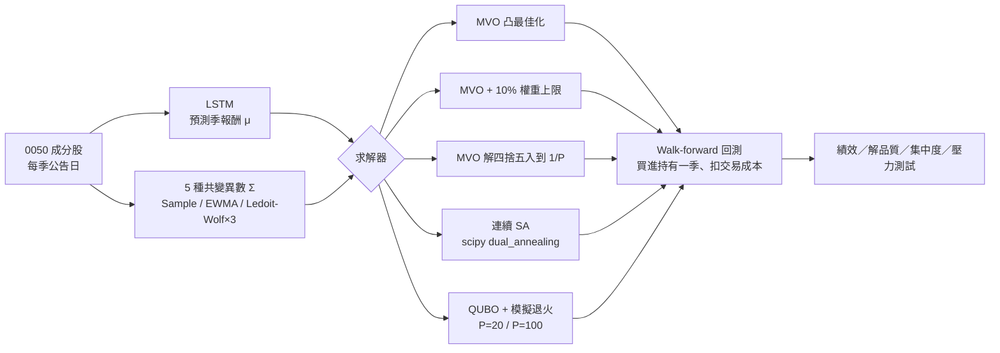
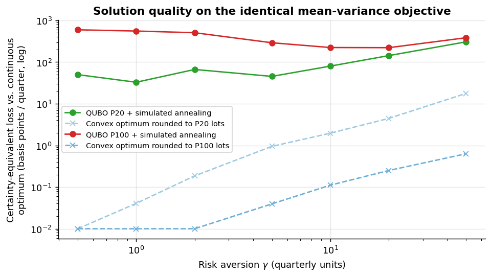
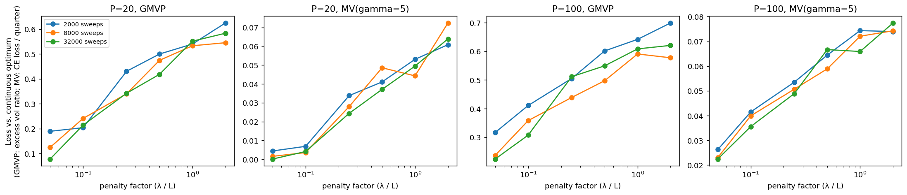
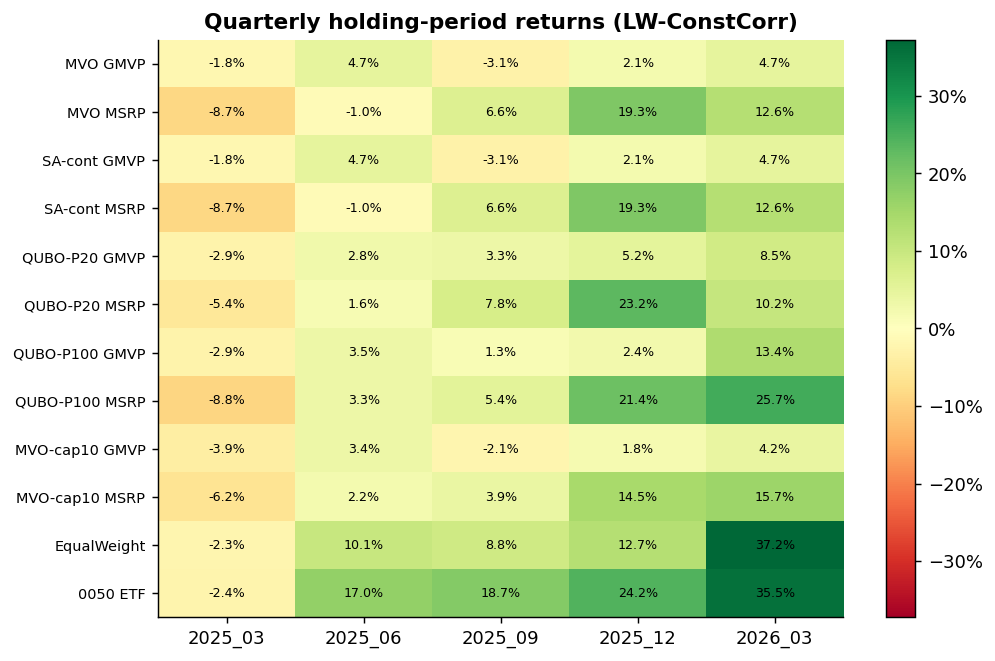
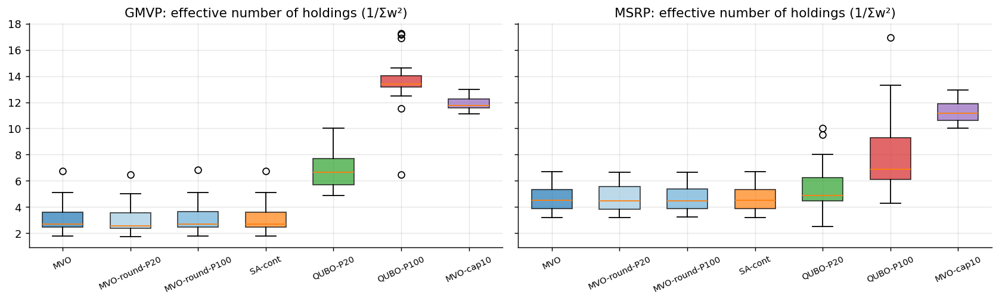

# 以 QUBO／退火求解投資組合最佳化：台灣 50 成分股的 Walk-Forward 實證

**Quantum-Annealing-Style (QUBO) Portfolio Optimization on Taiwan 50 Constituents — a walk-forward study**

[English summary](README.en.md) · [文獻回顧](docs/literature-review.md) · [期末簡報（PDF）](docs/slides/Quantum_Annealing_Portfolio_Optimization.pdf) · [量子退火教學簡報（PDF）](docs/slides/量子退火_教學簡報.pdf)

> 把 Markowitz 投資組合問題寫成 QUBO（D-Wave 量子退火機的輸入格式），以退火演算法求解，
> 並在 0050 成分股上做 5 季 walk-forward 回測，與古典凸最佳化、連續模擬退火及「凸最佳解四捨五入」等基準公平比較。


## 重點發現

1. **QUBO + 模擬退火的解，離最佳解很遠，而且原因不是離散化。** 在完全相同的均值—變異數目標下，QUBO 解平均每季損失 1.0（P=20）～4.0（P=100）個百分點的確定等值報酬，GMVP 的事前波動度比最佳解高 21%～31%；但把凸最佳解直接四捨五入到同樣的 1/P 格點，損失幾乎為 0（< 0.1 bp、波動度 +0.1%～1%）。瓶頸在於預算 penalty 所造成的能量地形：penalty 越小解越好，增加 sweeps 幾乎沒有幫助。精度從 P=20 提高到 P=100，解反而更差。
2. **樣本外，解得較差的 QUBO 組合 Sharpe 反而較高，但這是 beta，不是 alpha。** QUBO 組合較分散（GMVP 的有效持股數 7～14 檔，MVO 約 3 檔），對 0050 的 beta 也較高（GMVP 0.37 vs 0.18；MSRP 0.69 vs 0.49）。在 0050 五季上漲 128% 的多頭期間，這直接轉化為較高的報酬。若以 GMVP 本身的目標「低波動」衡量，MVO 的樣本外波動與最大回撤都比較低。
3. **簡單的顯式正則化就能複製大部分的效果。** 對 MVO 加上 10% 單一權重上限，MSRP 的樣本外 Sharpe（1.02）與 QUBO-P100（1.06）相當，而且波動與回撤都更低。
4. **所有最佳化組合都明顯輸給被動基準。** 等權重 Sharpe 2.25、0050 ETF 2.67，最好的最佳化組合約 1.26。LSTM 在決策日給出的預期報酬，與實際持有期報酬的排序相關平均只有 0.02。在這段期間，「最佳化」主要是在放大雜訊。

> **誠實聲明：本研究沒有使用量子硬體。** 所有 QUBO 結果都由 D-Wave Ocean 的古典模擬退火 `neal` 產生。
> 程式碼已預留 QPU／Leap hybrid 介面（[`samplers.py`](src/qaportfolio/samplers.py)），但 50 檔 × 7 bits 的稠密 QUBO
> 超過 Advantage QPU 可直接嵌入的規模。因此本研究的結論是關於「QUBO 形式與退火搜尋」，而非量子效應。

---

## 研究背景

本研究是我在 2026 年春季於**國立政治大學資訊管理學系 AI 量子計算實驗室（AI QC Lab）**進行的專題研究，負責「量子退火在投資組合最佳化的應用」。期間我也為實驗室準備了[量子退火教學簡報](docs/slides/量子退火_教學簡報.pdf)（QUBO、Ising 模型、絕熱定理、量子穿隧）。

原始研究只涵蓋單一季度，並以一份 notebook 完成（[封存版](archive/ch6_portfolio_optimization_original.ipynb)）。整理成公開 repo 時，我重新檢查了整個流程，修正了數個會影響結論的問題（例如三種方法的「MSRP」其實在解不同的問題），並延伸為 5 季 walk-forward 實驗。完整差異見 [`docs/original-results.md`](docs/original-results.md)。

**研究問題**：

* 把投資組合問題寫成 QUBO 並以退火求解，解的品質如何？瓶頸在哪裡？
* 在含雜訊的預期報酬下，「解得比較好」是否等於「投資比較好」？離散化是否會帶來類似正則化的效果？

## 方法



| 步驟 | 設定 |
|---|---|
| 投資範圍 | 各季 0050 成分股（49～51 檔），2025/03～2026/03 共 5 季 |
| 決策與持有 | 每年 3/6/9/12 月第一個星期五（0050 成分股調整公告日）收盤決定權重，持有至下一次公告日；long-only、權重和為 1 |
| 預期報酬 μ | 跨股票共用的單層 LSTM（63 日 × 19 個價量特徵 → 未來 63 日報酬），每季以當時可得資料重新訓練，訓練／驗證之間設 63 日 purge |
| 共變異數 Σ | 決策日前 252 個交易日；Sample、EWMA、Ledoit–Wolf（identity／constant-correlation／single-factor）。主圖使用事先指定的 LW-ConstCorr |
| 交易成本 | 手續費 0.1425%（買賣）＋證交稅 0.3%（賣） |
| 基準 | 等權重（每季再平衡）、0050 ETF 買進持有 |

### QUBO 建模

把資金切成 $P$ 份，$x_i\in\{0,\dots,P\}$ 為第 $i$ 檔分到的份數、$w_i=x_i/P$，並以有界二進位展開 $x_i=\sum_k c_k b_{ik}$（$P=20$：$c=(1,2,4,8,5)$；$P=100$：$c=(1,2,4,8,16,32,37)$）：

$$
\min_{b\in\{0,1\}^{nK}}\;\frac{\gamma}{2P^2}x^\top\Sigma x-\frac{1}{P}\mu^\top x+\lambda\Big(\sum_i x_i-P\Big)^2 .
$$

* **GMVP** 只保留 $x^\top\Sigma x/P^2$。
* **MSRP**：Sharpe 不是二次式，因此在 $\gamma\in\{0.5,1,2,5,10,20,50\}$ 上各解一次，取事前 Sharpe 最高者。
* **λ** 以「每違反一個 lot 可換得的最大目標改善量」$L$ 為尺度。$\lambda>L$ 理論上保證最低能量解可行，但實驗發現此時 penalty 主導地形、退火幾乎無法在可行解間移動。因此依 [penalty 敏感度實驗](scripts/penalty_sensitivity.py)，選擇可行率仍 ≥ 50% 的最小係數 $\lambda=0.1L$。這個實驗只使用第一季的事前輸入，不含任何未來資料；不可行的解以最大餘數法修復，並記錄比例。
* 求解器：`neal.SimulatedAnnealingSampler`（P=20：100 reads × 2,000 sweeps；P=100：300 reads × 8,000 sweeps）。

## 主要結果

### 1. 解的品質（同一個目標函數）



| | QUBO P=20 | QUBO P=100 | 凸最佳解四捨五入到 P=20 | 凸最佳解四捨五入到 P=100 |
|---|---:|---:|---:|---:|
| 均值—變異數：確定等值報酬損失（每季，7 個 γ 平均） | 103 bp | 397 bp | 4 bp | < 0.1 bp |
| GMVP：事前波動度 ÷ 最佳波動度 | 1.21 | 1.31 | 1.01 | 1.00 |
| 預算可行率（所有 reads；均值—變異數／GMVP） | 50%／97% | 57%／90% | — | — |
| 求解時間（每個問題，中位數） | 6 秒 | 155 秒 | ≈ 0 | ≈ 0 |

連續 SA（`dual_annealing`，約 2.5 秒）與 MVO 精確解幾乎完全一致。



*penalty 係數 λ/L 越小，解越接近最佳解；sweeps 從 2,000 增加到 32,000 幾乎沒有改善。最左側（0.05）的 MV 問題可行率接近 0，數值主要來自修復步驟。*

### 2. 樣本外績效（5 季、扣成本；跨 5 種共變異數估計式取中位數）

| 組合 | 方法 | 年化報酬 | 年化波動 | Sharpe | 最大回撤 | Beta (0050) | 平均周轉率 |
|---|---|---:|---:|---:|---:|---:|---:|
| GMVP | MVO | 7.0% | 11.7% | 0.64 | −7.5% | 0.18 | 34% |
| GMVP | 連續 SA | 7.0% | 11.7% | 0.64 | −7.5% | 0.18 | 34% |
| GMVP | MVO 四捨五入 P=100 | 6.8% | 11.8% | 0.62 | −7.5% | 0.18 | 35% |
| GMVP | MVO + 10% 上限 | 2.9% | 13.2% | 0.28 | −9.7% | 0.28 | 35% |
| GMVP | **QUBO P=20** | 14.9% | 13.3% | 1.11 | −9.3% | 0.28 | 64% |
| GMVP | **QUBO P=100** | 18.3% | 14.6% | 1.26 | −12.0% | 0.37 | 55% |
| MSRP | MVO | 19.6% | 24.7% | 0.85 | −17.8% | 0.49 | 82% |
| MSRP | 連續 SA | 19.6% | 24.7% | 0.85 | −17.8% | 0.49 | 82% |
| MSRP | MVO 四捨五入 P=100 | 19.6% | 24.7% | 0.85 | −17.7% | 0.49 | 83% |
| MSRP | MVO + 10% 上限 | 21.3% | 20.8% | 1.02 | −16.9% | 0.52 | 67% |
| MSRP | **QUBO P=20** | 26.9% | 30.2% | 0.90 | −21.8% | 0.63 | 82% |
| MSRP | **QUBO P=100** | 30.9% | 29.6% | 1.06 | −21.3% | 0.69 | 75% |
| — | 等權重 | 63.6% | 23.1% | **2.25** | −20.5% | 0.75 | 29% |
| — | 0050 ETF | 98.2% | 27.1% | **2.67** | −21.1% | 1.00 | — |

各策略、各估計式的完整數字見 [`results/summary/performance.csv`](results/summary/performance.csv)；每季報酬見下圖。





### 3. 預期報酬模型

| 季度 | 樣本外 Rank IC（決策日前 63 日） | 方向準確率 | 決策日 μ vs 實際持有期報酬的 Rank IC |
|---|---:|---:|---:|
| 2025/03 | 0.01 | 40% | −0.09 |
| 2025/06 | 0.13 | 64% | 0.18 |
| 2025/09 | 0.07 | 62% | 0.12 |
| 2025/12 | 0.17 | 66% | 0.16 |
| 2026/03 | 0.08 | 70% | −0.27 |
| **平均** | **0.09** | **61%** | **0.02** |

### 4. 與原始結論的對照

| 原始（單季、簡報）結論 | 重構後（5 季） |
|---|---|
| 「QA 的離散性帶來被動正則化」 | **部分成立，但需重新詮釋**：退火解較分散、樣本外 Sharpe 較高，但這來自較差的最佳化與較高的 beta，而非離散化本身（四捨五入解與 MVO 幾乎相同）；MSRP 的效果可以被 10% 權重上限複製 |
| 「精度 100 反而降低搜尋品質（精度陷阱）」 | **成立**：P=100 的確定等值損失約為 P=20 的 4 倍，與「最高位係數大、地形更崎嶇」的解釋一致 |
| 「QA100 在 MSRP 勝 11/15」 | 原比較中 QA20、QA100 與 MVO 解的其實是三個不同的問題；統一目標後，QUBO-P100 的 MSRP 平均名次仍是 7 種方法中最佳（2.6），但領先幅度與 beta 差異一致 |
| 「50 檔資產仍屬凸問題，量子潛力在 NP-hard 設定」 | **成立**，並得到更強的佐證：在凸問題上，連古典的四捨五入都遠勝 QUBO＋退火 |

## 限制

* **沒有量子硬體**：結果反映的是模擬退火在 QUBO 上的表現，不能推論真實 QPU 的表現。
* **樣本小、市場單一**：只有 5 季，且全部落在台股的強勁多頭（0050 +128%）；沒有任何統計檢定能在這個樣本下區分 beta 與 alpha。
* **預期報酬近乎雜訊**：MSRP 的結論高度依賴 μ 的品質；更好的預測模型可能改變排序。
* **QUBO 的 MSRP 是近似**：以 γ 網格掃描效率前緣，與直接最大化 Sharpe 不完全相同。
* **超參數**：penalty 依第一季的事前目標函數選定；sweeps／reads 沿用原始設定。

## 重現

```bash
git clone https://github.com/brianwen818/quantum-annealer-in-portfolio-optimization.git
cd quantum-annealer-in-portfolio-optimization
conda env create -f environment.yml && conda activate qaportfolio   # 或 pip install -r requirements.txt

pytest                                   # 單元測試（QUBO 能量 = 目標 + penalty 等）
python scripts/run_experiments.py        # 5 季完整實驗（16 核 CPU 約 1.5 小時；LSTM 結果會快取）
python scripts/penalty_sensitivity.py    # penalty × sweeps 敏感度（約 20 分鐘）
python scripts/analyze.py                # 產生 results/summary 與 results/figures
```

repo 已附上所有中間結果（`results/`），可直接開啟 notebooks 查看分析。若要改用真實 QPU：設定環境變數 `DWAVE_API_TOKEN`，並把 `config/default.yaml` 中的 `qubo.sampler` 改為 `qpu` 或 `hybrid`。

## Repo 結構

```
├── config/default.yaml          # 所有實驗設定（季度、LSTM、共變異數、QUBO、成本）
├── src/qaportfolio/
│   ├── data.py  schedule.py     # 資料讀取、0050 公告日時間表
│   ├── features.py  forecast_lstm.py   # 特徵工程、LSTM（含防洩漏切分）
│   ├── covariance.py  mvo.py    # 共變異數估計、凸最佳化
│   ├── qubo.py  samplers.py     # QUBO 建模／解碼、neal / QPU / hybrid 介面
│   ├── continuous_sa.py         # scipy dual_annealing
│   ├── backtest.py  montecarlo.py  analysis.py  plotting.py
│   └── pipeline.py              # 單季完整流程
├── scripts/                     # run_experiments / penalty_sensitivity / analyze / download_data
├── notebooks/                   # 01～06：資料、LSTM、MVO、QUBO、回測、壓力測試（附執行結果）
├── results/<quarter>/           # 各季 μ、Σ、權重、求解紀錄
├── results/summary/  figures/   # 彙總表與圖
├── data/                        # 個股（FinMind）、0050 持股（TEJ）、0050 ETF（Yahoo）— 見 data/README.md
├── docs/
│   ├── literature-review.md     # 文獻回顧（66 篇參考文獻）
│   ├── lit-review-search/       # 系統性文獻蒐集紀錄（Crossref 22 本期刊 + arXiv）
│   ├── original-results.md      # 原始版本與重構版本的差異
│   └── slides/                  # 期末簡報、量子退火教學簡報
├── archive/                     # 原始研究 notebook（封存）
└── tests/
```

## 資料與授權

* 個股還原股價：[FinMind](https://finmindtrade.com/)；0050 成分股持股明細：TEJ 台灣經濟新報；0050 ETF：Yahoo Finance。資料經實驗室同意公開，僅供研究重現使用，詳見 [`data/README.md`](data/README.md)。
* 程式碼採 [MIT License](LICENSE)。

## 作者

温亮達（brianwen818）· 國立政治大學 · AI QC Lab
